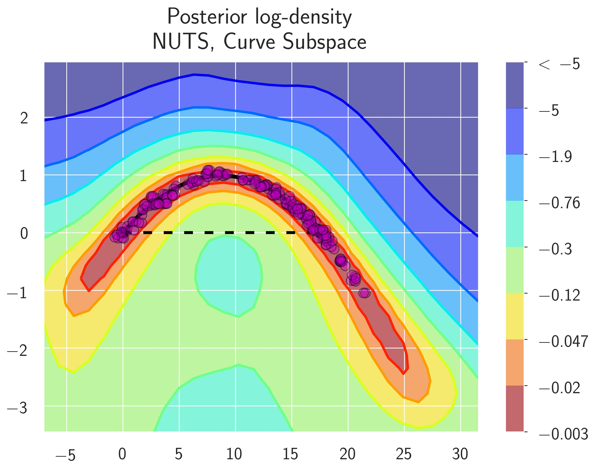
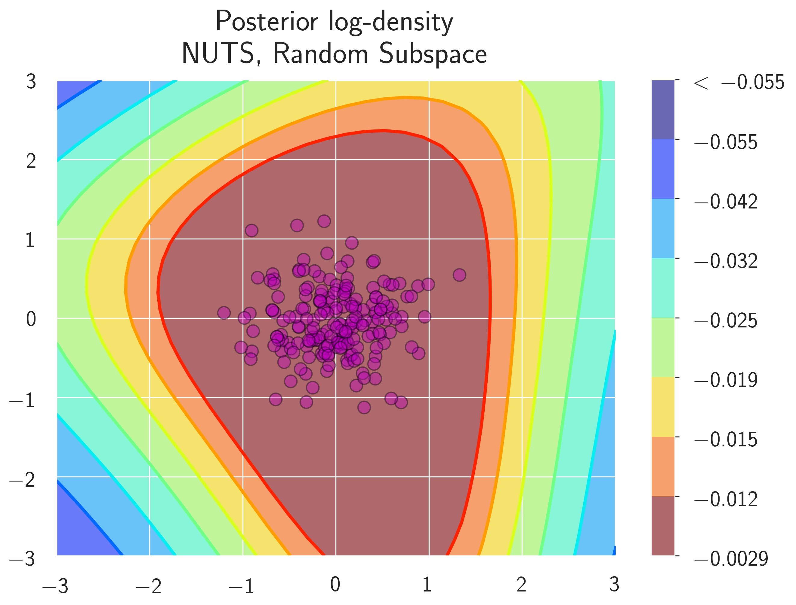
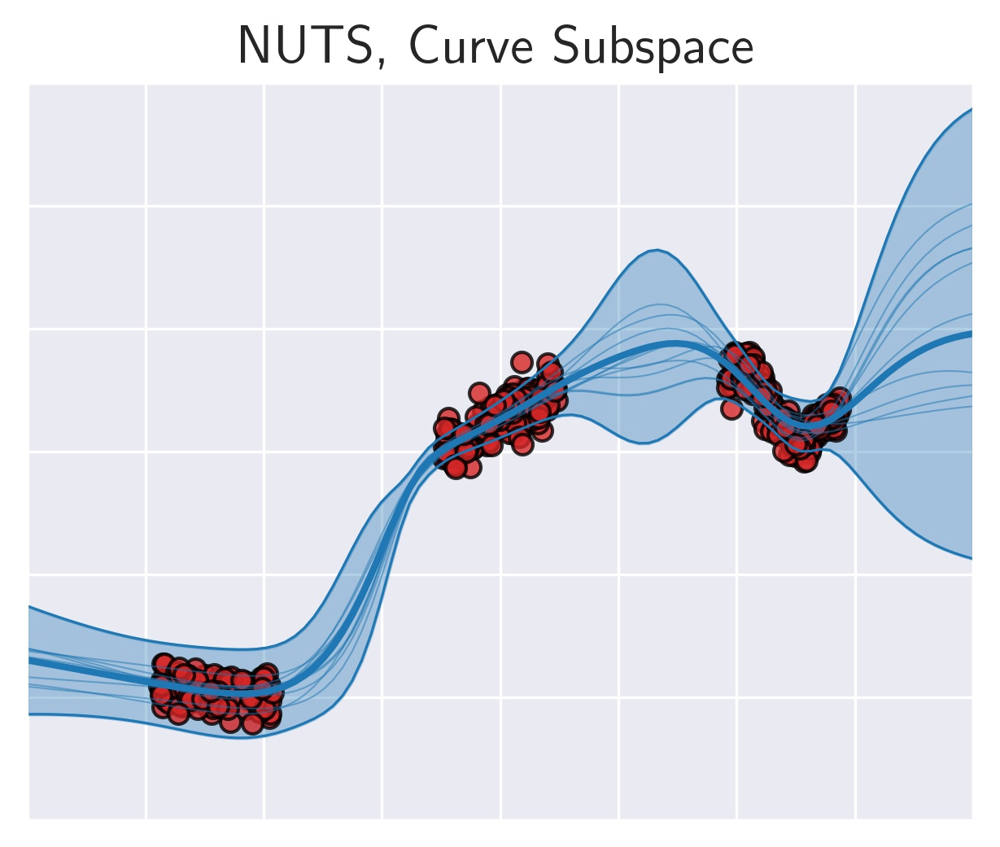
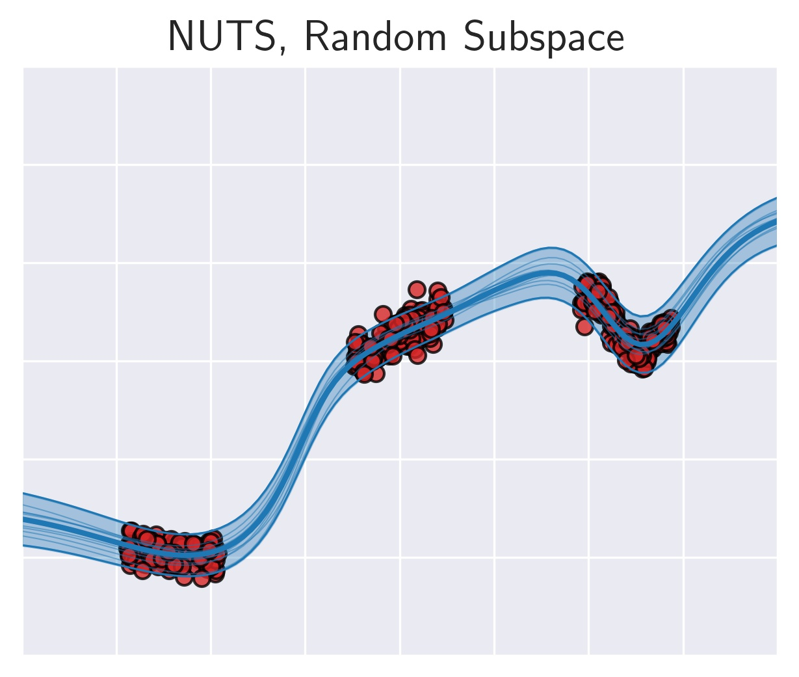

# Subspace Inference for Bayesian Deep Learning

This repository contains a PyTorch implementation of Dimensionality Reduced Bayesian Inference (DR Bayes) from the paper:

*Subspace Inference for Bayesian Deep Learning*

by [Pavel Izmailov](https://izmailovpavel.github.io/), [Wesley Maddox](https://wjmaddox.github.io/), Polina Kirichenko, Timur Garipov, Dmitry Vetrov, and Andrew Gordon Wilson

Please cite our work if you find it useful:
```
@article{izmailov_subspace_2019,
  title={Subspace Inference for Bayesian Deep Learning},
  author={Izmailov, Pavel and Maddox, Wesley and Kirichenko, Polina and Garipov, Timur and Vetrov, Dmitry and Wilson, Andrew Gordon},
  journal={UAI},
  year={2019}
}
```

## Introduction

DR Bayes is a convenient (and differently motivated) method for uncertainty representation for Bayesian deep learning.
The main idea is to construct a subspace of DNN model (we suggest the SGD iterates) before using a standard approximate Bayesian inference method (we suggest elliptical slice sampling) in this subspace.
We then use the subspace posterior distribution to perform Bayesian model averaging, for improved uncertainty representations.

*Loss Surfaces*

|     Curve Subspace, NUTS |   Random Subspace, NUTS  |
:-------------------------:|:-------------------------:
 | 

*Predictions*

|     Curve Subspace, NUTS |   Random Subspace, NUTS  |
:-------------------------:|:-------------------------:
 | 

## Installation:

```bash
python setup.py develop
```

See requirements.txt file for requirements that came from our setup. We use Pytorch 1.0.0 in our experiments.

Unless otherwise described, all experiments were run on a single GPU.

## File Structure

```
.
+-- swag/
|   +-- posteriors/
    |   +-- swag.py (class definition for SWA, SWAG and SWAG-Diag)
    |   +-- laplace.py (class definition for KFAC Laplace)
|   +-- models/ (Folder with all model definitions)
|   +-- utils.py (utility functions)
+-- experiments/
|   +-- train/ (folder containing standard training scripts for non-ImageNet data)
|   +-- imagenet/ (folder containing ImageNet training scripts)
|   +-- grad_cov/ (gradient covariance and optimal learning rate experiments)      

|   +-- hessian_eigs/ (folder for eigenvalues of hessian)

|   +-- uncertainty/ (folder containing scripts and methods for all uncertainty experiments)
|   +-- width/ (folder containing scripts for PCA and SVD of SGD trajectories)
+-- tests/ (folder containing tests for SWAG sampling and SWAG log-likelihood calculation.)
```

### Example Commands

**See experiments/* for particular READMEs**

[Toy Regression](notebooks/toy_regression_final.ipynb)

[Image Classification](experiments/train/README.md)

[Uncertainty](experiments/uncertainty/README.md)

[Regression](experiments/bayesian_benchmarks/README.md)

Some other commands are listed here:

*Hessian eigenvalues*

```cd experiments/hessian_eigs; python run_hess_eigs.py --dataset CIFAR100 --data_path [data_path] --model PreResNet110 --use_test --file [ckpt] --save_path [output.npz] ```

*Automatic choice of dimensionality*

See [toy problem notebook](notebooks/pen_pca_tests.ipynb) and [preresnet notebook](notebooks/preresnet_pca.ipynb)

## References for Code Base

SWAG: [Pytorch repo](https://github.com/wjmaddox/swa_gaussian); the codebase was originally the SWAG repo.

Stochastic weight averaging: [Pytorch repo](https://github.com/timgaripov/swa/); many of the base methods and model definitions are built off of this repo.

Model implementations:
  - VGG: https://github.com/pytorch/vision/
  - PreResNet: https://github.com/bearpaw/pytorch-classification
  - WideResNet: https://github.com/meliketoy/wide-resnet.pytorch
  - FCDensenet67: https://github.com/bfortuner/pytorch_tiramisu

Hessian eigenvalue computation: We ultimately ended up using [GPyTorch](https://gpytorch.ai) as it allows calculation of more eigenvalues.

Bayesian benchmarks: [Repo](https://github.com/hughsalimbeni/bayesian-benchmarks); the folder in here is a clone of that repo; we'll eventually submit our models as a fork to the main repo.
